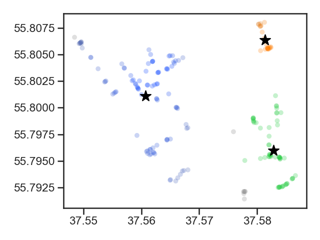
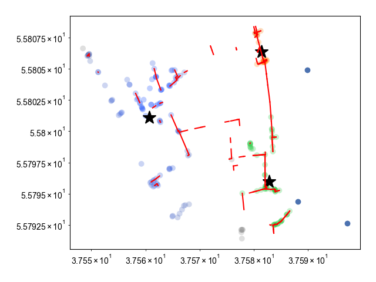
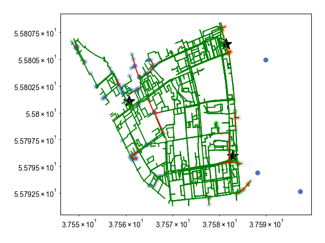

# Hackathon. Case: GAZPROMBANK

<h1 align="center">
  
</h1>

## Overview

Prototype of a geoinformation system for tracking the excess or insufficiency of the bank atms in the cities of the presence.

## Key features
 - Smart algorithm analyzing graph and pedestrian traffic
 - Map with the optimal location of ATMs on the graph
 - New ATM coordinates

## Result

#### Savelovsky district






```
Банкомат №1
ШИРОТА: 55.80108653608246;
ДОЛГОТА: 37.56073218556702;
АДРЕС: Поликлиника №157, 12, улица Юннатов, Савёловский район, Северный административный округ, Москва, Центральный федеральный округ, 127083, Россия

Банкомат №2
ШИРОТА: 55.806392826086956;
ДОЛГОТА: 37.58138765217391;
АДРЕС: 89, Бутырская улица, Савёловский район, Северный административный округ, Москва, Центральный федеральный округ, 127015, Россия

Банкомат №3
ШИРОТА: 55.795976913793105;
ДОЛГОТА: 37.582851706896555;
АДРЕС: Спортивная школа олимпийского резерва № 25, 28, Вятская улица, Савёловский район, Северный административный округ, Москва, Центральный федеральный округ, 127015, Россия
```
